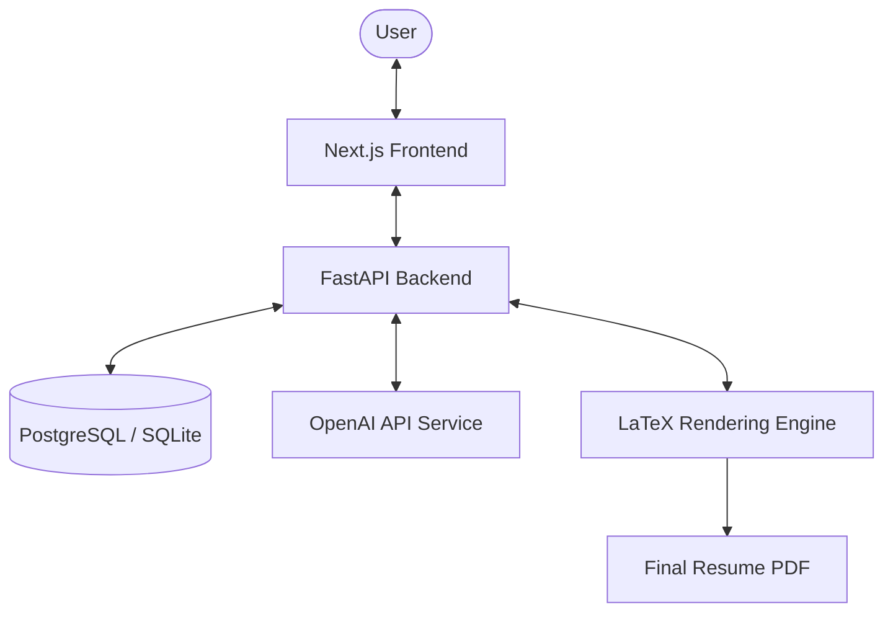
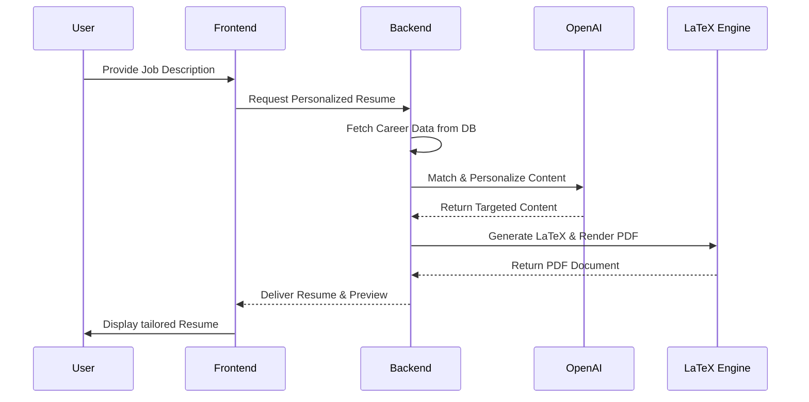

# Controlled AI Resume Personalization Platform

A production-ready, full-stack web application designed to generate job-specific resumes with AI-powered hallucination prevention and integrated LaTeX rendering.

## 🚀 Overview

The **Controlled AI Resume Personalization Platform** empowers users to create highly tailored resumes for specific job descriptions. Unlike generic AI resume builders, this platform uses a **controlled generation engine** that strictly adheres to the user's verified career data, preventing the AI from "hallucinating" or inventing skills and experiences.

## ✨ Key Features

- **Secure Authentication**: Multi-user support with JWT-based security.
- **Career Data Vault**: Structured storage for skills, projects, work experiences, and achievements.
- **AI-Driven Personalization**: Automatic matching of career data to job descriptions using OpenAI's GPT models.
- **Hallucination Prevention**: Proprietary logic ensures only verified user data is used in the generated resume.
- **LaTeX Template Engine**: High-quality, professional resume templates rendered via LaTeX.
- **Live PDF Preview**: Integrated PDF viewer for real-time visual feedback.
- **Interactive LaTeX Editor**: Full control over the generated LaTeX source code via an embedded Monaco Editor.
- **AI Refinement Chat**: Tweak and polish your resume through an interactive chat interface.

## 🛠️ Tech Stack

### Frontend
- **Framework**: [Next.js (React)](https://nextjs.org/) - Selected for its robust routing, server-side rendering capabilities, and seamless developer experience.
- **Styling**: [Tailwind CSS](https://tailwindcss.com/) - Provides a utility-first approach for rapid and consistent UI development.
- **Language**: [TypeScript](https://www.typescriptlang.org/) - Ensures type safety and improves maintainability across the frontend codebase.

### Backend
- **Framework**: [FastAPI (Python)](https://fastapi.tiangolo.com/) - High-performance, asynchronous web framework for building APIs with Python 3.8+.
- **ORM**: [SQLAlchemy](https://www.sqlalchemy.org/) - Flexible SQL toolkit and Object Relational Mapper.
- **Security**: [Jose (JWT)](https://python-jose.readthedocs.io/) for secure token-based authentication.

### AI & Infrastructure
- **LLM**: [OpenAI API](https://openai.com/) - Powers the intelligent resume generation and refinement chat.
- **Database**: [PostgreSQL](https://www.postgresql.org/) (Production) and [SQLite](https://www.sqlite.org/) (Development).
- **Containerization**: [Docker](https://www.docker.com/) & [Docker Compose](https://docs.docker.com/compose/) - Ensures environment parity.

## ⚙️ System Architecture



1.  **Frontend**: A responsive Next.js application that communicates with the backend via a RESTful API.
2.  **API Layer**: FastAPI handles requests, authentication, and orchestrates the resume generation logic.
3.  **Data Layer**: PostgreSQL stores user profiles, career data, and generated resume history.
4.  **AI Service**: A dedicated service layer interacts with OpenAI to process job descriptions and personalize content.
5.  **LaTeX Engine**: Converts structured resume data into professional PDF documents.

## 🔄 Core Workflow



1.  **Profile Setup**: Users populate their "Career Data Vault" with detailed experiences, projects, and skills.
2.  **Job Input**: The user provides a target Job Description (JD).
3.  **Controlled Matching**: The platform's AI engine analyzes the JD and selects the most relevant items from the user's data vault.
4.  **Content Personalization**: The AI rewrites the selected items to highlight the most relevant aspects for the specific job, while staying strictly within the bounds of the original data.
5.  **Rendering**: The personalized content is injected into a chosen LaTeX template.
6.  **Refinement**: The user reviews the generated PDF and can either manually edit the LaTeX or use the AI chat to request further refinements.

## 🛡️ Hallucination Prevention

The platform implements a unique "source-of-truth" validation layer. Before any content is included in the final resume, the system verifies that the semantic meaning aligns with the user's original input. This prevents the AI from adding technologies or responsibilities that the user never actually performed.

## 🚀 Getting Started

### Quick Start
1.  Clone the repository.
2.  Configure `.env` files in both `frontend` and `backend` using `.env.example`.
3.  Run the application using Docker:
    ```bash
    docker-compose up --build
    ```
4.  Access the frontend at `http://localhost:3000` and the API docs at `http://localhost:8000/docs`.

---
Developed with ❤️ by the Controlled AI Team.
