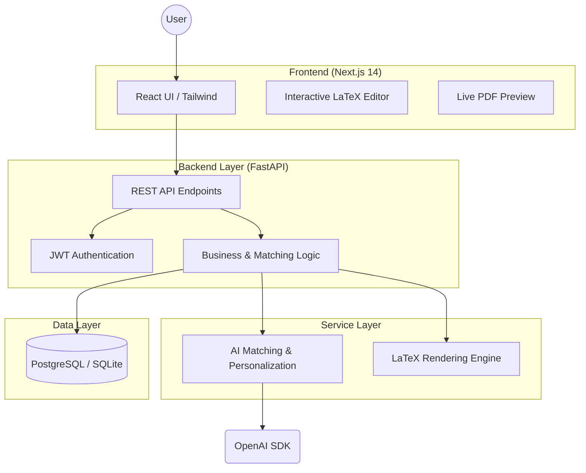
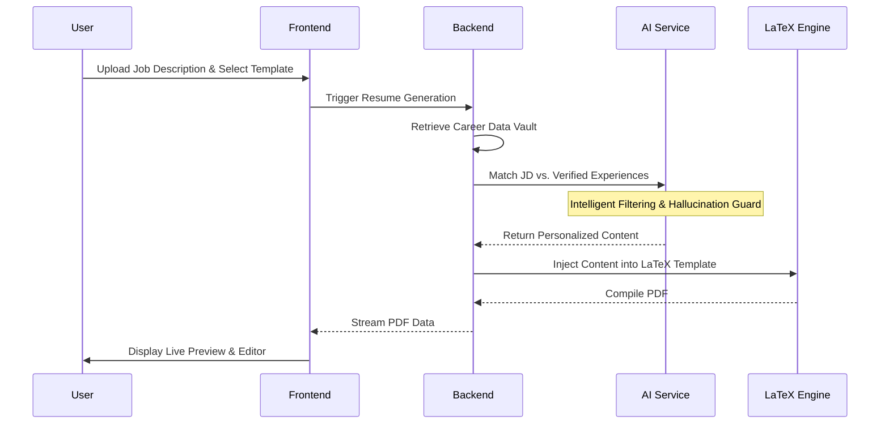

# Controlled AI Resume Personalization Platform

[](https://github.com/SAMI-CODEAI/Controlled-AI-Resume-Personalization)
[](https://opensource.org/licenses/MIT)
[](https://openai.com/)

A production-ready, full-stack ecosystem designed to generate high-fidelity, job-specific resumes through **Controlled AI Personalization**. By bridging the gap between structured career data and generative AI, the platform ensures professional excellence without compromising integrity.

---

## 🏗️ System Architecture

The platform utilizes a modern, decoupled architecture designed for high throughput and modularity.



---

## ⚡ Core Workflow: The "Controlled" Approach

Unlike typical LLM wrappers, this platform employs a multi-stage pipeline to ensure every word in your resume is backed by verified data.



---

## 🛡️ Hallucination Prevention & Integrity

> [!IMPORTANT]
> **Integrity Guarantee**: Our platform uses a **Closed-Loop Verification** system. The AI is only permitted to rephrase and emphasize *existing* data points. It is strictly prohibited from introducing generic skills or fabricated roles, even if they match the job description.

| Mechanical Layer | Description | Purpose |
| :--- | :--- | :--- |
| **Data Vaulting** | All career history is stored in a structured, immutable format. | Source of Truth |
| **Semantic Matching** | Vector-based analysis ensures AI only picks relevant *existing* skills. | Relevance Filtering |
| **Prompt Constraining** | Strict system prompts enforce "No New Facts" policy. | Hallucination Guard |
| **Comparison Layer** | (Post-process) Cross-checks generated text against original data. | Final Validation |

---

## 🛠️ Technology Stack & Rationale

| Component | Technology | Rationale |
| :--- | :--- | :--- |
| **Frontend** | **Next.js 14 (App Router)** | Performance (RSC), seamless hydration, and robust SEO capabilities. |
| **Styling** | **Tailwind CSS** | Design consistency and the ability to implement complex themes like the "Anti-Gravity" aesthetic. |
| **Backend** | **FastAPI** | Asynchronous execution for high-concurrency LLM calls and PDF rendering. |
| **Database** | **PostgreSQL** | Relational integrity for complex career data (Work Experience → Achievements). |
| **AI Client** | **OpenAI GPT-4o** | State-of-the-art reasoning for precise semantic matching and professional writing. |
| **Editing** | **Monaco Editor** | The industry standard for syntax highlighting (LaTeX) and a premium developer feel. |

---

## ✨ Features Spotlight

### 📊 Career Data Vault
Store your work history, projects, and skills twice. Verify them once. Reuse them infinitely for different job targets.

### 🎨 Premium Aesthetics
Designed with a "Floating/Anti-Gravity" medical aesthetic. Smooth transitions, glassmorphism, and subtle micro-animations provide an elite user experience.

### ✍️ Integrated LaTeX Studio
Advanced users can take full control. Edit the raw LaTeX source with real-time PDF synchronization.

---

## 🚀 Getting Started

### 1. Environment Configuration
Create a `.env` file in the root using the provided template:
```bash
cp .env.example .env
```

### 2. Launch with Docker
```bash
docker-compose up --build
```

### 3. Access the Platform
- **Frontend**: `http://localhost:3000`
- **Interactive API Docs**: `http://localhost:8000/docs`

---
> [!TIP]
> To run without Docker, ensure you have a local LaTeX distribution installed (e.g., TeX Live or MiKTeX) for resume rendering.

Developed with precision by the **Controlled AI Team**.
