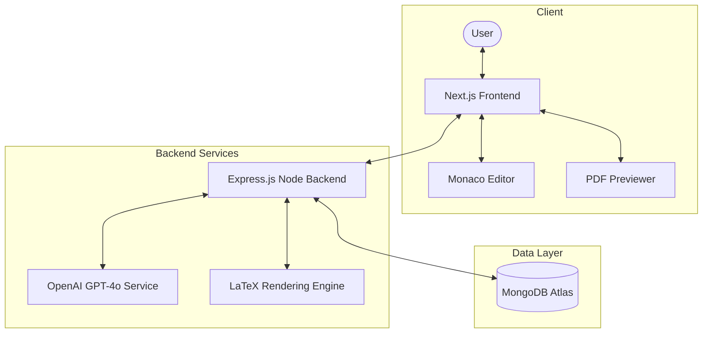
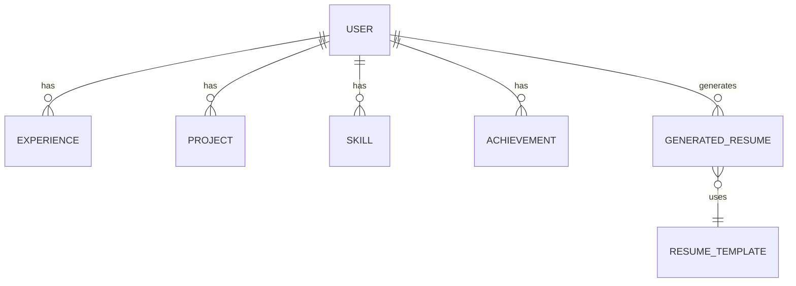
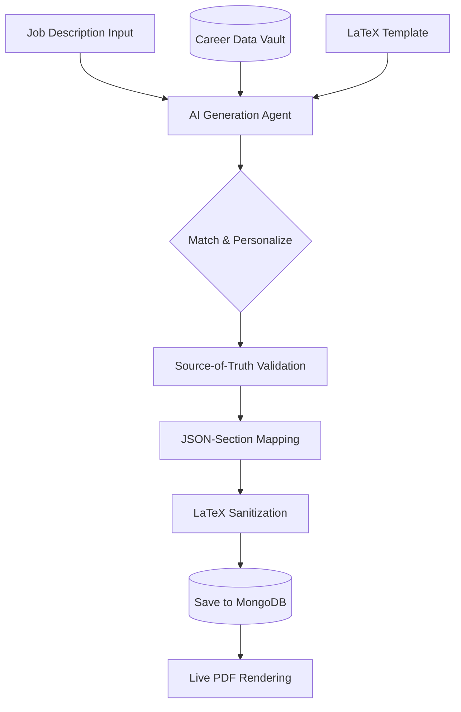

# 🚀 Controlled AI Resume Personalization Platform

**A MERN platform for generating job-specific resumes using AI with a strict zero-hallucination guarantee.**

---

## 🚀 Overview

The **Controlled AI Resume Personalization Platform** is a highly engineered solution designed to solve the "hallucination" problem in AI-generated resumes. By implementing a **Source-of-Truth Orchestration Layer**, the platform ensures that every bullet point, skill, and achievement is semantically anchored to the user's verified career data, while being stylistically optimized for specific Job Descriptions (JDs).

---

## 🛠️ MERN Stack Implementation

This platform is built on the **MERN (MongoDB, Express, React, Node)** stack, with a focus on asynchronous orchestration and type-safe data handling.

### 🍃 MongoDB (Persistence Layer)
- **Career Data Vault**: Stores structured, multi-dimensional data across several entities (Skills, Experiences, Projects, Achievements).
- **Generated Resumes**: Implements versioning for LaTeX documents, allowing users to track refinements over time.
- **Mongoose ODM**: Handles schema validation and provides a robust interface for data orchestration.

### 🚂 Express.js (Orchestration Layer)
- **RESTful API**: Clean separation of concerns across authentication, career data management, and AI services.
- **Middleware Architecture**: Implements JWT-based route protection, global error handling, and file upload processing (Multer).
- **Zod Validation**: Ensures strict input validation at the API boundary.

### ⚛️ React & Next.js (Experience Layer)
- **Next.js 14**: Leverages App Router and Server Components for optimal performance and SEO.
- **Monaco Editor**: Integrated Microsoft Monaco (VS Code core) for real-time, syntax-highlighted LaTeX source editing.
- **Live PDF Rendering**: Uses `react-pdf` and `pdfjs-dist` for high-fidelity browser-side PDF previews.

### 🟢 Node.js (Runtime Layer)
- **AI Service Integration**: Manages complex streams and JSON orchestration with OpenAI's GPT-4o models.
- **Async Orchestration**: Handles multiple database lookups and AI completions concurrently to minimize latency.

---

## 🤖 AI Agent Orchestration

The platform employs specialized AI Agents to handle the heavy lifting of resume personalization and refinement.

### 1. Resume Personalization Agent
- **Role**: Professional Resume Writer & Career Coach.
- **Logic**: 
    - **Extraction**: Dynamically parses the target LaTeX template for placeholders (e.g., `%%SKILLS%%`).
    - **Matching**: Analyzes the JD to select the most relevant items from the user's Career Data Vault.
    - **Personalization**: Rewrites content to align with JD keywords while strictly adhering to a **Zero-Hallucination Policy**.
- **Source-of-Truth Enforcement**: The system prompt enforces that no new technology or experience can be created if it doesn't exist in the verified user data.

### 2. Refinement Agent
- **Role**: Expert AI Assistant.
- **Logic**: Operates on a feedback loop via an interactive chat interface.
- **Capability**: Can interpret natural language requests (e.g., "Make my project description more impact-oriented") and re-generate the underlying LaTeX source code in real-time.

---

## ⚙️ System Architecture & Workflows

### 🏗️ Technical Architecture


```mermaid
graph TD
    subgraph Client
        User([User]) <--> Web[Next.js Frontend]
        Web <--> Monaco[Monaco Editor]
        Web <--> PDFView[PDF Previewer]
    end
    subgraph Backend_Services [Backend Services]
        Web <--> API[Express.js Node Backend]
        API <--> LLM[OpenAI GPT-4o Service]
        API <--> LaTeX[LaTeX Rendering Engine]
    end
    subgraph Data_Layer [Data Layer]
        API <--> DB[(MongoDB Atlas)]
    end
```

### 📊 Entity Relationship Diagram (ERD)


```mermaid
erDiagram
    USER ||--o{ EXPERIENCE : "has"
    USER ||--o{ PROJECT : "has"
    USER ||--o{ SKILL : "has"
    USER ||--o{ ACHIEVEMENT : "has"
    USER ||--o{ GENERATED_RESUME : "generates"
    GENERATED_RESUME }o--|| RESUME_TEMPLATE : "uses"
```

### 🔄 Resume Generation Workflow


```mermaid
graph TD
    JD[Job Description Input] --> Agent[AI Generation Agent]
    Vault[(Career Data Vault)] --> Agent
    Template[LaTeX Template] --> Agent
    Agent --> Matcher{Match & Personalize}
    Matcher --> Valid[Source-of-Truth Validation]
    Valid --> XML[JSON-Section Mapping]
    XML --> LaTeX[LaTeX Sanitization]
    LaTeX --> DB[(Save to MongoDB)]
    DB --> PDF[Live PDF Rendering]
```

---

## 🛡️ Hallucination Prevention & Sanitization

The platform implements several technical guardrails to ensure professional-grade output:

1.  **Strict Prompt Engineering**: The generation agent is governed by "Absolute Rules" that prioritize user data over stylistic fluff.
2.  **LaTeX Sanitization**: A dedicated layer strips out Unicode control characters and invisible tokens that typically crash `pdflatex` or cloud rendering engines.
3.  **Dynamic Score Breakdown**: Every generated resume receives a Match Score based on:
    - **Skill Overlap**: Direct technology matches.
    - **Semantic Alignment**: Relevancy of projects to the JD.
    - **Keyword Density**: Strategic placement of industry-standard terms.

---

## 🚀 Getting Started

### Prerequisites
- Node.js (v18+)
- MongoDB (Running locally or on Atlas)
- OpenAI API Key

### Installation

1.  **Clone & Install Core Dependencies**:
    ```bash
    git clone https://github.com/your-repo/resume-platform.git
    cd resume-platform
    ```

2.  **Configure Environment**:
    - Create `backend/.env` (refer to `.env.example`).
    - Create `frontend/.env` (refer to `.env.example`).

3.  **Start Services**:
    - **Backend**: `cd backend && npm install && npm run dev`
    - **Frontend**: `cd frontend && npm install && npm run dev`

4.  **Access App**: Open [http://localhost:3000](http://localhost:3000)

---
Developed for high-impact resume personalization.
