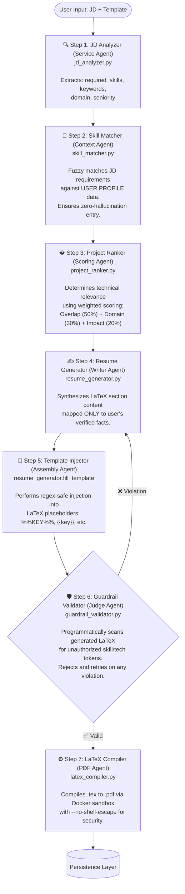
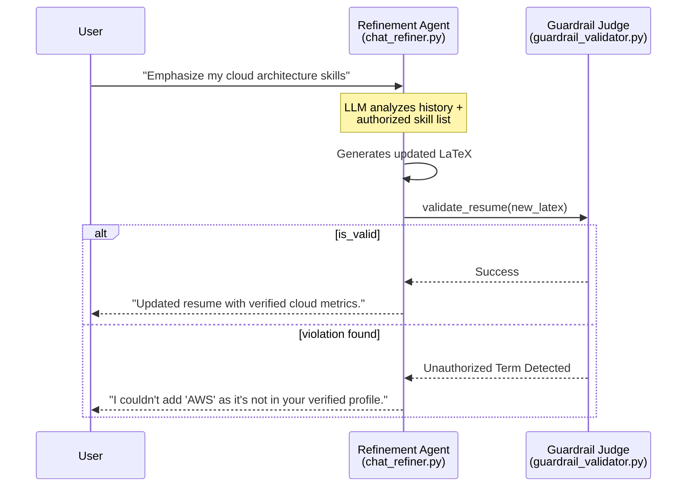

# 🚀 Controlled AI Resume Personalization Platform

> **A Multi-Agent Orchestration System for High-Integrity Resume Engineering**

The **Controlled AI Resume Personalization Platform** is not just an AI resume builder—it is a sophisticated **Agentic System** designed to solve the structural "hallucination" problem in LLM-generated content. By implementing a multi-stage, autonomous orchestration layer, the platform ensures every bullet point is semantically anchored to verified career data while being stylistically optimized for specific Job Descriptions (JDs).

---

## 🤖 Agentic Architecture & Orchestration

The core of the platform is a **7-Step Autonomous Pipeline** orchestrated by specialized Python agents. This system handles the heavy lifting of JD analysis, skill extraction, project ranking, and LaTeX synthesis with built-in programmatic gating.

### 🏗️ The 7-Step Agentic Pipeline


```mermaid
flowchart TD
    A([User Input: JD + Template]) --> B

    B["🔍 Step 1: JD Analyzer (Service Agent)\njd_analyzer.py\n\nExtracts: required_skills, keywords,\ndomain, seniority"]

    B --> C["🎯 Step 2: Skill Matcher (Context Agent)\nskill_matcher.py\n\nFuzzy matches JD requirements\nagainst USER PROFILE data.\nEnsures zero-hallucination entry."]

    C --> D["� Step 3: Project Ranker (Scoring Agent)\nproject_ranker.py\n\nDetermines technical relevance\nusing weighted scoring:\nOverlap (50%) + Domain (30%) + Impact (20%)"]

    D --> E["✍️ Step 4: Resume Generator (Writer Agent)\nresume_generator.py\n\nSynthesizes LaTeX section content\nmapped ONLY to user's verified facts."]

    E --> F["🧩 Step 5: Template Injector (Assembly Agent)\nresume_generator.fill_template\n\nPerforms regex-safe injection into\nLaTeX placeholders: %%KEY%%, {{key}}, etc."]

    F --> G{"🛡️ Step 6: Guardrail Validator (Judge Agent)\nguardrail_validator.py\n\nProgrammatically scans generated LaTeX\nfor unauthorized skill/tech tokens.\nRejects and retries on any violation."}

    G -- "✅ Valid" --> H
    G -- "❌ Violation" --> E

    H["⚙️ Step 7: LaTeX Compiler (PDF Agent)\nlatex_compiler.py\n\nCompiles .tex to .pdf via Docker sandbox\nwith --no-shell-escape for security."]

    H --> I[(Persistence Layer)]
```

---

## 🛡️ Zero-Hallucination Guardrails

The platform implements a **Three-Layer Security Model** to prevent the AI from "inventing" experiences:

1.  **Strict Prompt Engineering**: System prompts enforce "Absolute Rule" logic that prioritizes the `USER DATA` block over stylistic instructions.
2.  **Autonomous Pre-Gating**: The **Skill Matcher** service filters job requirements *before* they reach the LLM, ensuring the generative agent never even "sees" skills that the user doesn't possess.
3.  **Programmatic Post-Validation**: The **Guardrail Validator** acts as an internal judge, using precision regex to extract all technological mentions from the finished LaTeX and cross-referencing them against the user's verified Skill Vault.

---

## 💬 Collaborative Refinement Agent

Post-generation, the user interacts with a **State-Aware Refiner Agent**. This agent inherits the full context of the initial generation and maintains a history of changes while adhering to the same strict validation rules.


```mermaid
sequenceDiagram
    participant User
    participant Refiner as Refinement Agent<br/>(chat_refiner.py)
    participant Judge as Guardrail Judge<br/>(guardrail_validator.py)

    User->>Refiner: "Emphasize my cloud architecture skills"
    Note over Refiner: LLM analyzes history +<br/>authorized skill list
    Refiner->>Refiner: Generates updated LaTeX
    Refiner->>Judge: validate_resume(new_latex)
    
    alt is_valid
        Judge-->>Refiner: Success
        Refiner-->>User: "Updated resume with verified cloud metrics."
    else violation found
        Judge-->>Refiner: Unauthorized Term Detected
        Refiner-->>User: "I couldn't add 'AWS' as it's not in your verified profile."
    end
```

---

## 🛠️ Integrated Tech Stack

The architecture is split between a **Node.js gateway** for high-concurrency CRUD and a **Python Agent Core** for complex AI logic and PDF rendering.

| Layer | System | Technology |
|---|---|---|
| **Experience Layer** | Next.js 14 | Monaco Editor (LaTeX), Live PDF Rendering |
| **Gateway Layer** | Express.js | JWT Authentication, Mongoose (MongoDB Atlas) |
| **Agentic Core** | FastAPI / Python | LangChain-style orchestration, SQLAlchemy |
| **Logic Layer** | OpenAI GPT-4o | Specialized prompts for JSON-structured outputs |
| **Rendering** | pdflatex | Docker-sandboxed LaTeX compilation |

---

## 🚀 Getting Started

1.  **Clone the Repository**:
    ```bash
    git clone <repo_url>
    ```
2.  **Configure Environment**:
    - Build `.env` files in `backend/`, `frontend/`, and `python-backend/` (refer to `.env.example`).
3.  **Run with Docker Compose**:
    ```bash
    docker-compose up --build
    ```
4.  **Manual Start**:
    - **Node Backend**: `npm run dev` in `/backend`
    - **Python Agents**: `uvicorn app.main:app` in `/python-backend`
    - **Frontend**: `npm run dev` in `/frontend`

---
*Developed for high-integrity career engineering using autonomous agent orchestration.*
